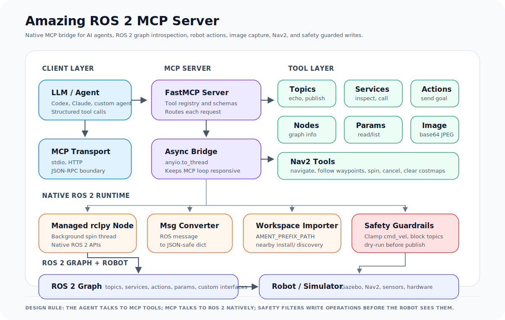

# Amazing ROS 2 MCP Server

A native ROS 2 MCP server for AI-assisted robot development and autonomous agents.

Amazing ROS 2 MCP exposes a ROS 2 graph to LLM agents through the Model Context Protocol. It runs directly on `rclpy`, so agents can inspect topics, services, actions, nodes, parameters, images, and Nav2 interfaces without requiring `rosbridge`.

## Why This Project

Many ROS agent integrations depend on WebSocket bridges or narrow tool surfaces. This project is designed as a native ROS 2 control harness:

- Native `rclpy` node, no `rosbridge` dependency.
- Direct support for custom workspace messages and services.
- Broad ROS 2 graph coverage: topics, services, actions, nodes, parameters, images, and Nav2.
- Safety guardrails for write operations, including velocity clamping and topic blocklists.
- Cached publishers for repeated low-latency publishing.
- Structured JSON output suitable for LLM planning loops and robotics debugging.

## Architecture

<p align="center">
  
</p>

The agent never talks to ROS 2 directly. It calls MCP tools over `stdio` or HTTP. FastMCP routes the request, blocking ROS work runs through `anyio.to_thread`, and a managed `rclpy` node performs native ROS 2 operations. Write paths pass through safety guardrails before reaching the robot or simulator.

## Features

### ROS 2 Graph Introspection

- List topics, services, actions, and nodes.
- Inspect topic publishers and subscribers.
- Inspect message, service, and action schemas.
- Inspect node publishers, subscribers, services, and clients.
- Read node parameters.

### ROS 2 Interaction

- Subscribe once to a topic and return JSON.
- Publish JSON data to a ROS 2 topic.
- Call ROS 2 services.
- Send action goals and wait for results.
- Capture camera images as base64 JPEG data.

### Nav2 Support

- Navigate to a pose.
- Follow waypoint sequences.
- Spin in place.
- Cancel active navigation.
- Clear global, local, or all costmaps.

### Workspace Support

MCP clients often launch tools in isolated environments. Amazing ROS 2 MCP discovers workspace Python paths from `AMENT_PREFIX_PATH` and nearby `install/` folders so custom interfaces can be imported even when the client did not perfectly source the workspace.

### Safety Controls

- Clamp unsafe `/cmd_vel` values before publishing.
- Block configured sensitive topics.
- Enable dry-run mode to inspect outgoing writes without publishing them.

## Available Tools

### Core Graph Tools

| Tool | Purpose |
| --- | --- |
| `list_topics` | List active topics and types |
| `list_services` | List active services and types |
| `list_actions` | List active action servers |
| `list_nodes` | List nodes and namespaces |
| `get_topic_details` | Show publishers, subscribers, and topic type |
| `get_message_details` | Show fields and types for a ROS message |
| `get_service_details` | Show request and response fields for a ROS service |
| `get_action_details` | Show goal, result, and feedback fields for a ROS action |
| `get_node_info` | Show publishers, subscribers, services, and clients for a node |
| `list_parameters` | List parameters on a node |
| `get_parameters` | Read selected parameter values |
| `detect_ros_version` | Report ROS distribution, Python version, and RMW |

### Interaction Tools

| Tool | Purpose |
| --- | --- |
| `get_topic_message` | Read one message from a topic |
| `publish_message` | Publish JSON data to a topic |
| `call_service` | Call a ROS 2 service |
| `send_action_goal` | Send a ROS 2 action goal |
| `get_camera_image` | Capture an image topic as base64 JPEG |

### Nav2 Tools

| Tool | Purpose |
| --- | --- |
| `navigate_to_pose` | Send a Nav2 goal pose |
| `follow_waypoints` | Send a waypoint sequence |
| `spin_robot` | Rotate the robot in place |
| `cancel_navigation` | Cancel active navigation |
| `clear_costmaps` | Clear Nav2 costmaps |

## Installation

```bash
git clone https://github.com/proxi666/amazing-ros2-mcp.git
cd amazing-ros2-mcp
pip install -e .
```

For Nav2 tools:

```bash
pip install -e ".[nav2]"
```

## Usage

Source ROS 2 and your workspace before starting the server:

```bash
source /opt/ros/humble/setup.bash
source ~/your_ws/install/setup.bash
python -m amazing_ros2_mcp
```

HTTP mode:

```bash
TRANSPORT_MODE=http HTTP_HOST=0.0.0.0 HTTP_PORT=3001 python -m amazing_ros2_mcp
```

## MCP Client Configuration

Claude Desktop or any stdio MCP client can launch the server with:

```json
{
  "mcpServers": {
    "amazing-ros2-mcp": {
      "command": "bash",
      "args": [
        "-lc",
        "source /opt/ros/humble/setup.bash && source ~/your_ws/install/setup.bash && python -m amazing_ros2_mcp"
      ]
    }
  }
}
```

## Environment Variables

| Variable | Default | Description |
| --- | --- | --- |
| `TRANSPORT_MODE` | `stdio` | Transport mode: `stdio`, `http`, or `streamable-http` |
| `HTTP_HOST` | `0.0.0.0` | HTTP bind address |
| `HTTP_PORT` | `3001` | HTTP port |
| `LOG_LEVEL` | `INFO` | Logging verbosity |
| `ROS_NAMESPACE` | none | Namespace for the MCP node |
| `AMAZING_ROS2_WORKSPACE` | none | Optional workspace root for custom package discovery |

## Safety Configuration

Safety limits are configured in `amazing_ros2_mcp/config.py`:

```python
@dataclass
class SafetyConfig:
    max_linear_x: float = 1.0
    max_linear_y: float = 0.5
    max_angular_z: float = 1.5
    blocked_topics: tuple = ("/emergency_stop", "/diagnostics")
    dry_run: bool = False
```

## Comparison Notes

Amazing ROS 2 MCP is intended for native ROS 2 workflows where an AI agent needs more than graph inspection. Compared with rosbridge-based MCP servers, the main differences are:

- Native DDS access through `rclpy`.
- Custom interface import from local colcon workspaces.
- Nav2-aware tools for mobile robot navigation.
- Safety filtering before robot commands are published.
- Cached publishers for repeated commands.
- Direct image capture for vision-capable agents.

Rosbridge-based servers remain useful for browser-oriented or remote WebSocket workflows. This server is focused on native ROS 2 development and robot-agent control.

## Credits

This project synthesizes patterns and inspiration from several excellent community projects:
- **[robotmcp/ros-mcp-server](https://github.com/robotmcp/ros-mcp-server)** — Inspiration for tool categorization, FastMCP annotations, and image workflow design.
- **[kakimochi/ros2-mcp-server](https://github.com/kakimochi/ros2-mcp-server)** — Pioneers of the background spin-thread pattern for native `rclpy` integration.
- **[ajtudela/nav2_mcp_server](https://github.com/ajtudela/nav2_mcp_server)** — Excellent reference for Nav2 integration via `anyio.to_thread`.

## Contributing

Contributions are welcome. New tool groups should be small, focused, and registered from `src/amazing_ros2_mcp/tools/__init__.py`.

Suggested additions:

- TF2 inspection tools.
- MoveIt 2 tools.
- Rosbag recording and playback tools.
- Diagnostics and lifecycle management tools.
- Additional safety policies for physical robots.

## License

Apache-2.0. See [LICENSE](LICENSE).
